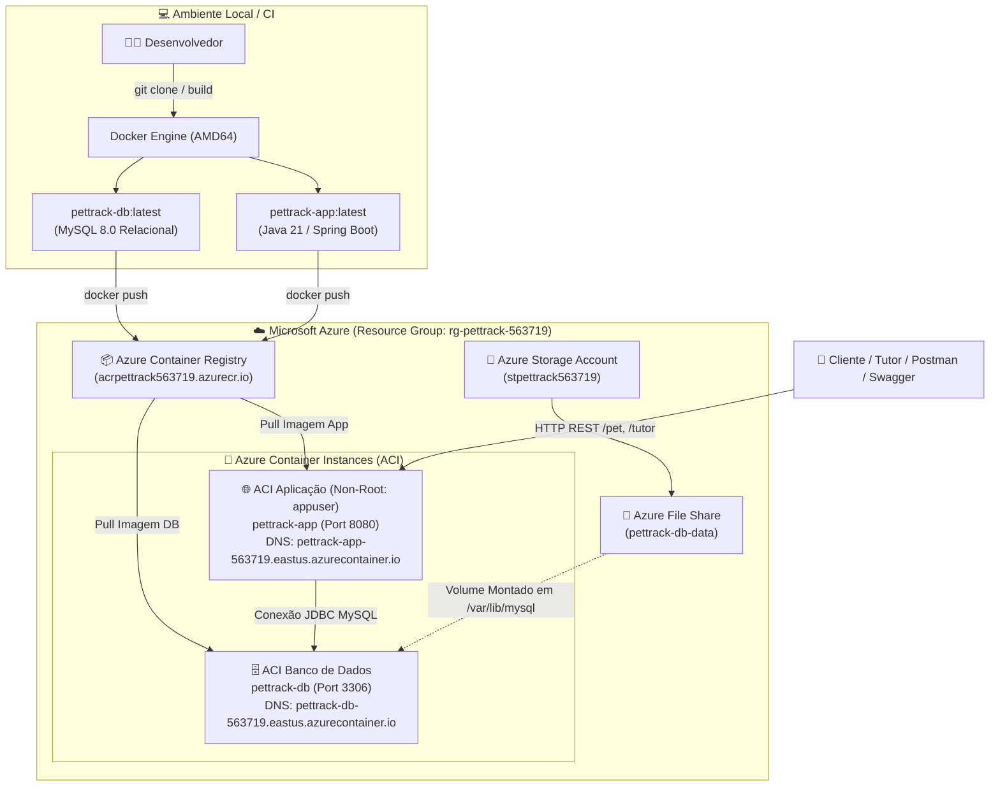

# 🐾 PetTrack (Clyvo Vet) — Infraestrutura em Nuvem & DevOps
## ☁️ Sprint 3 — DevOps Tools & Cloud Computing (Challenge FIAP 2026)

> Plataforma inteligente para monitoramento contínuo e gestão preventiva da saúde de animais de estimação, conectando tutores, clínicas veterinárias e coleiras inteligentes IoT.

---

## 👥 Integrantes do Grupo

| Nome Completo | RM | Turma |
| :--- | :---: | :---: |
| **Gabriel Sbrana Campos** | 565849 | 2TDS |
| **Moisés Waidemann Molinillo Júnior** | 563719 | 2TDS |
| **Richard Freitas** | 566127 | 2TDS |
| **Thiago Rodrigues da Mota** | 563650 | 2TDS |

* **Repositório GitHub:** https://github.com/Challenge-PetTrack/DEVOPS-TOOLS-CLOUD-COMPUTING
* **Vídeo Demonstrativo no YouTube:** https://youtu.be/jpeR_fnbQNE

---

## 📌 1. Descrição da Solução

O **PetTrack** é um ecossistema digital desenvolvido para a **Clyvo Vet** com o objetivo de transformar o cuidado veterinário de reativo para proativo. A solução integra uma API RESTful corporativa em **Java com Spring Boot** conectada a um banco de dados relacional em nuvem com persistência de dados.

A plataforma gerencia o ciclo completo de saúde dos pets: cadastro de tutores, registro de animais, histórico de eventos clínicos, acompanhamento de adesão medicamentosa e alertas preventivos disparados por telemetria (temperatura e nível de atividade).

---

## 💼 2. Benefícios para o Negócio

1. **Prevenção e Diagnóstico Precoce:** Monitoramento constante de parâmetros biométricos via IoT, reduzindo custos com internações emergenciais.
2. **Centralização e Rastreabilidade do Histórico:** Prontuário único do animal acessível por tutores e clínicas credenciadas.
3. **Fidelização e Engajamento:** Alertas automatizados para o tutor sobre horários de medicação e consultas preventivas.
4. **Infraestrutura Escalável e Resiliente:** Solução totalmente conteinerizada com **Azure Container Instances (ACI)** e **Azure Container Registry (ACR)**, garantindo provisionamento ágil via Azure CLI e custos proporcionais ao uso.
5. **Segurança Corporativa:** Execução de containers com usuário não-root (`appuser`), isolamento de redes e segregação de credenciais via variáveis de ambiente.

---

## 🏗️ 3. Arquitetura da Solução na Microsoft Azure (ACR + ACI)

A solução adota a **Opção 1 (ACR + ACI com persistência em Azure Storage File Share)** conforme as diretrizes da Sprint 3:



---

## 📁 4. Estrutura de Diretórios do Repositório

```text
DEVOPS-TOOLS-CLOUD-COMPUTING/
├── README.md                          # Documentação oficial, arquitetura e how-to
├── script_bd.sql                      # Script DDL com tabelas core, PK/FK, comentários e dados iniciais
├── ENTREGA_PDF_MODELO.md              # Template do PDF oficial exigido na submissão
├── json-tests/                        # Payloads de teste para demonstração no vídeo
│   ├── 01-post-tutor.json             # Criação de Tutor (POST)
│   ├── 02-post-pet.json               # Criação de Pet associado (POST)
│   ├── 03-put-pet.json                # Atualização de Pet (PUT)
│   └── 04-delete-pet-info.json        # Exclusão de Pet (DELETE)
├── scripts/
│   ├── 01-deploy-azure.sh             # Script Azure CLI para build, push e deploy completo
│   └── 02-destroy-azure.sh            # Script para desalocação de recursos da nuvem
├── app/                               # Código-fonte da aplicação Java Spring Boot
│   ├── Dockerfile                     # Multi-stage build com usuário NÃO-ROOT (appuser)
│   ├── pom.xml                        # Dependências Maven (Spring Boot, JPA, MySQL Connector, Swagger)
│   └── src/                           # Controllers, Models, DTOs, Mappers, Repositories e Services
└── db/                                # Container do Banco de Dados Relacional
    ├── Dockerfile                     # Imagem MySQL 8.0
    └── docker-entrypoint-initdb.d/
        └── init.sql                   # Cópia do script_bd.sql para inicialização automática
```

---

## 🛡️ 5. Segurança e Boas Práticas

* **Usuário Não-Root no Container:** O container da aplicação roda com o usuário sem privilégios `appuser` (UID 1000/1001), atendendo ao **Requisito 8.2** do PDF.
* **Persistência de Dados em Nuvem:** O banco de dados utiliza volume persistente conectado ao **Azure File Share**, garantindo que reinicializações do container não percam informações.
* **Segregação de Credenciais:** As credenciais de banco e chaves de acesso são injetadas exclusivamente via variáveis de ambiente nos containers.
* **Banco Relacional Real:** Utilizado **MySQL 8.0** com integridade referencial (`FOREIGN KEY`), índices e tipos adequados (sem bancos em memória voláteis como H2).

---

## 🚀 6. How-To: Instalação e Deploy na Azure (Passo a Passo)

### Pré-requisitos
* Docker instalado e rodando
* Azure CLI instalada e autenticada (`az login`)
* Git instalado

### Passo 1 — Clonar o Repositório
```bash
git clone https://github.com/Challenge-PetTrack/DEVOPS-TOOLS-CLOUD-COMPUTING.git
cd DEVOPS-TOOLS-CLOUD-COMPUTING
```

### Passo 2 — Executar o Provisionamento Automatizado via Azure CLI
```bash
chmod +x scripts/01-deploy-azure.sh
./scripts/01-deploy-azure.sh
```

O script realizará automaticamente:
1. Build das imagens Docker (`pettrack-app` e `pettrack-db`) em arquitetura `linux/amd64`.
2. Criação do Resource Group `rg-pettrack-563719` na região `eastus`.
3. Criação do Azure Container Registry (ACR) `acrpettrack563719`.
4. Login e envio (`push`) das imagens para o ACR.
5. Criação do Storage Account e File Share `pettrack-db-data`.
6. Criação do container ACI do Banco de Dados com volume persistente montado.
7. Criação do container ACI da Aplicação conectado ao banco.

---

## 🧪 7. Roteiro de Demonstração do CRUD e Evidências SQL

Abaixo estão os comandos para testar o CRUD completo em duas tabelas relacionadas (`tb_tutor` e `tb_pet`) e comprovar a persistência diretamente no banco:

### URLs Públicas:
* **API Pets:** `http://pettrack-app-563719.eastus.azurecontainer.io:8080/pet/todos`
* **API Tutores:** `http://pettrack-app-563719.eastus.azurecontainer.io:8080/tutor/todos`
* **Swagger UI:** `http://pettrack-app-563719.eastus.azurecontainer.io:8080/swagger`

---

### 1️⃣ READ (Consultar Dados Iniciais das Tabelas Relacionadas)
```bash
# Consultar Tutores
curl -X GET http://pettrack-app-563719.eastus.azurecontainer.io:8080/tutor/todos

# Consultar Pets
curl -X GET http://pettrack-app-563719.eastus.azurecontainer.io:8080/pet/todos
```

---

### 2️⃣ CREATE (Inserir Novo Tutor e Novo Pet Relacionado)

**Criar Tutor:**
```bash
curl -X POST http://pettrack-app-563719.eastus.azurecontainer.io:8080/tutor/novo \
  -H "Content-Type: application/json" \
  -d @json-tests/01-post-tutor.json
```

**Criar Pet associado ao Tutor ID 1:**
```bash
curl -X POST http://pettrack-app-563719.eastus.azurecontainer.io:8080/pet/novo \
  -H "Content-Type: application/json" \
  -d @json-tests/02-post-pet.json
```

**Evidência no Banco de Dados (SELECT com JOIN):**
```bash
docker run --rm mysql:8.0 mysql -h pettrack-db-563719.eastus.azurecontainer.io -u pettrack_user -pPetTrack@2026Secure -D pettrack -e "SELECT p.id_pet, p.nm_pet AS Pet, p.ds_especie, p.ds_raca, t.nm_tutor AS Tutor, p.nr_peso_kg FROM tb_pet p INNER JOIN tb_tutor t ON p.id_tutor = t.id_tutor;"
```

---

### 3️⃣ UPDATE (Atualizar Dados do Pet Criado)
```bash
curl -X PUT http://pettrack-app-563719.eastus.azurecontainer.io:8080/pet/atualizar/100 \
  -H "Content-Type: application/json" \
  -d @json-tests/03-put-pet.json
```

**Evidência no Banco de Dados:**
```bash
docker run --rm mysql:8.0 mysql -h pettrack-db-563719.eastus.azurecontainer.io -u pettrack_user -pPetTrack@2026Secure -D pettrack -e "SELECT id_pet, nm_pet, ds_raca, nr_peso_kg FROM tb_pet WHERE id_pet = 100;"
```

---

### 4️⃣ DELETE (Remover o Pet)
```bash
curl -X DELETE http://pettrack-app-563719.eastus.azurecontainer.io:8080/pet/remover/100
```

**Evidência no Banco de Dados (Comprovação da Exclusão):**
```bash
docker run --rm mysql:8.0 mysql -h pettrack-db-563719.eastus.azurecontainer.io -u pettrack_user -pPetTrack@2026Secure -D pettrack -e "SELECT id_pet, nm_pet FROM tb_pet WHERE id_pet = 100;"
```

---

## 🧹 8. Destruição e Limpeza dos Recursos em Nuvem

Para remover todos os recursos na Azure e encerrar faturamentos:

```bash
chmod +x scripts/02-destroy-azure.sh
./scripts/02-destroy-azure.sh
```
